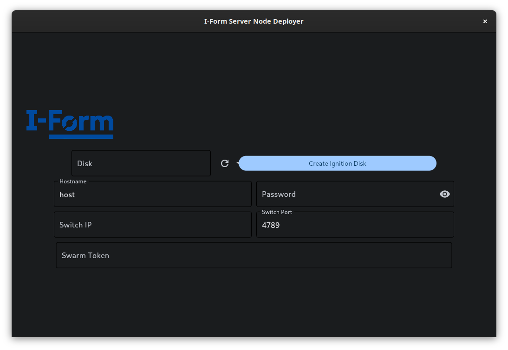

# Deploying New Nodes
The deployment of new nodes can be achieved in several ways. To maintain maximum flexibility, these methods range from extremely user friendly methods to more complex methods that require a greater degree of technical knowledge. The following sections will describe the various methods available for deploying new nodes.

## Using the Node Deployer GUI
The node deployer GUI is a simple, user friendly tool that allows the user to deploy new nodes to the server with minimal technical knowledge. This tool is available at the [node deployer repository](https://github.com/Cian-H/I-Form_Server_Node_Deployer).<br>
<br>
As long as the user has the correct IP address for the switch, and the correct swarm token, this tool will automatically create an ignition drive that will automatically configure the new node to join the server cluster. The user will also need to [https://get.opensuse.org/leapmicro/5.5/](create an OpenSUSE Leap Micro) install USB using the "Self-Install" image. To deploy the node, the user will then need to insert both USB drives into the new node and boot from the OpenSUSE USB. By following the on screen instructions, the node will be automatically configured and added to the cluster.

## Using the Node Deployer CLI
For more advanced users, the node deployer CLI can be used to deploy new nodes. This tool is available at the [node deployer repository](https://github.com/Cian-H/I-Form_Server_Node_Deployer).
<br><br>

<br><br>
Similar to the GUI, this tool can automatically create an ignition drive that will automatically configure the new node to join the server cluster. Again, the user will also need to [https://get.opensuse.org/leapmicro/5.5/](create an OpenSUSE Leap Micro) install USB using the "Self-Install" image. This can be achieved using a tool such as [Etcher](https://www.balena.io/etcher/). To deploy the node, the user will then need to insert both USB drives into the new node and boot from the OpenSUSE USB. By following the on screen instructions, the node will be automatically configured and added to the cluster. An ignition drive can be created using the following command:
``` bash
node_deployer create-ignition-disk -d <disk> -ip <switch-ip> -t <swarm-token>
```
This tool can also be used to create .img files that can be flashed to the node's internal storage. This is useful for nodes that do not have USB ports or for other purposes such as constructing containerised nodes. To create an image file, the following command can be used:
``` bash
node_deployer create-img -o <output> -ip <switch-ip> -t <swarm-token>
```
The user can then flash this image to the node's internal storage using a tool such as [Etcher](https://www.balena.io/etcher/).<br>
Finally, the node deployer CLI can also be used to create an image from a JSON configuration file. This is useful as a means of saving deployment configurations for easy use in the future, or to deploy configurations built using other server configuration tools such as the [https://opensuse.github.io/fuel-ignition/](fuel-ignition) deployer. To achieve this, the following command can be used:
``` bash
node_deployer json-to-img -i <input> -o <output>
```
Further documentation on the node deployer CLI can be found at the [node deployer documentation site](https://i-form-node-deployer.netlify.app/commands/)

## Using the Node Deployer API
In addition to the dedicated applications, the node deployer can also be used as a library. This allows the user to integrate the node deployer into their own applications. For example, to achieve the same result as the GUI, the following code could be used:
``` python
from node_deployer import create_ignition_disk

create_ignition_disk(
    disk="/dev/sdb",
    password="password",
    switch_ip="192.168.1.1",
    swarm_token="EXAMPLE_SWARM_TOKEN"
)
```
This code will create an ignition drive at /dev/sdb that will automatically configure the new node to join the swarm managed by the switch at the IP 192.168.1.1. Further documentation regarding this library is available at the deployer's [documentation site](https://i-form-node-deployer.netlify.app/).

## Requirements
All of the above methods require the user to have the following:
- Python 3.12 or greater
- The node deployer software
- Docker
- An OpenSUSE Leap Micro install USB