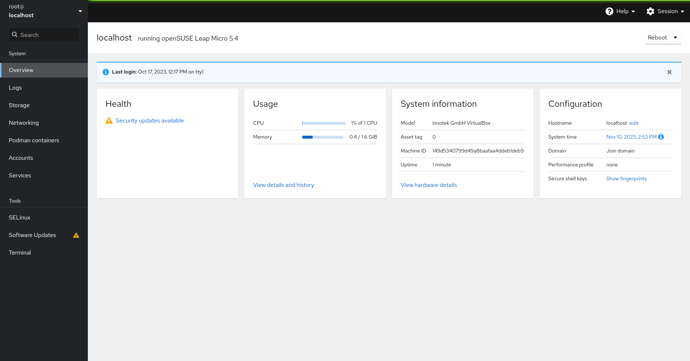
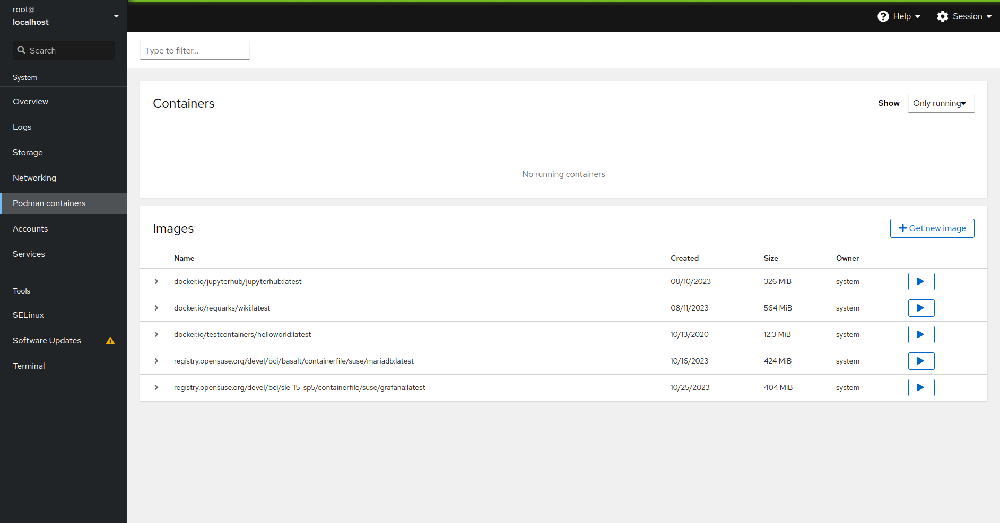
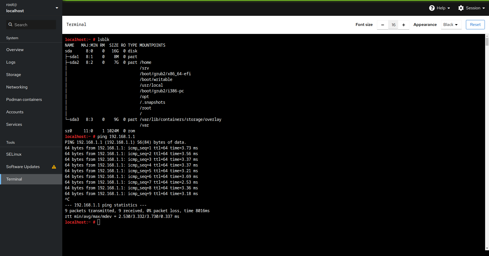

# Usage
## Server Management
Once the server has been accessed, the user will be presented with a login screen. Once logged in, the user will be presented with a dashboard from which the server can be managed. This dashboard is provided via the [cockpit project](https://cockpit-project.org) and from here it is possible to manage all functions of the server. Via the dropdown in the top left, the user can immediately connect to any node in the cluster. For each node, the system options and tools will then allow the user to interact with the nodes in the server. Management of the overall cluster is facilitated through interactions with any of the central switch nodes. 

  

## Deploying Applications
New docker containers can be deployed to the server node using the "Podman containers" tab of the cockpit UI. This page provides a list of all currently running containers, as well as a list of all available containers. Docker containers are deployed by contructing from images. To deploy a new container, simply click the "Get new image" button, and search for the container image you wish to deploy. Once the image has been downloaded, click the "run" button and set the configuration for building the container. At this point, the container will be built and deployed automatically. 
 
**NOTE: This method will only deploy the container on a single node. Deployment to the cluster is currently implemented via portainer and documentation for this will be added soon.**

 

## Accessing the terminal
By clicking the "Terminal" tab the user can directly interact with the selected node via a terminal. Through this terminal, all available installed programs can be executed and the user can interact with the server as if they were directly connected to it. This is particularly useful for debugging and troubleshooting issues with the server. 
 
Here, the system can be managed, software can be updated (this can also be achieved via the "Software Updates" tab), and new native software can be installed (although, this should be avoided without good reason).